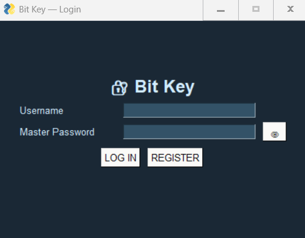
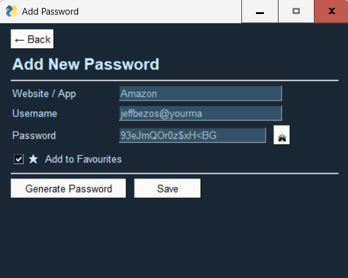
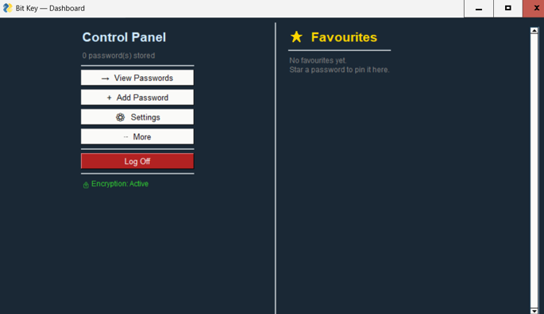

# Bit-Key-Password-Manager

Overview

Bit-Key is a secure, fully local desktop password manager, developed in Python using AES-256 CBC encryption with Argon2id hashing. The application allows users to safely store and manage their credentials while using modern cryptographic techniques. The passwords are encrypted using AES-256 CBC, while the master password is protected by the Argon2id hashing.

Features:
- Secure login system, using a master password initially
- AES-256 with Cipher Block Chaining (CBC) for storing the credentials
- Argon2id password hashing
- Password generation for creating strong passwords
- Management of favourites
- Search and organise saved credentials
- Import and export passwords vaults for transfer between devices

Technologies Used:
- Python
- SQLite
- PySimpleGUI
- Argon2id
- AES-256 with Cipher Block Chaining

Screenshots:
Login screen:

Password vault:

Password generator:

Dashboard:

How to Run:
1: Clone the repository
2: Install dependencies using: 'pip install -r requirements.txt'
3: Run: 'python main.py'

Latest version available in releases.

Author:
Developed by Benjamin Kay as part of a university dissertation.
